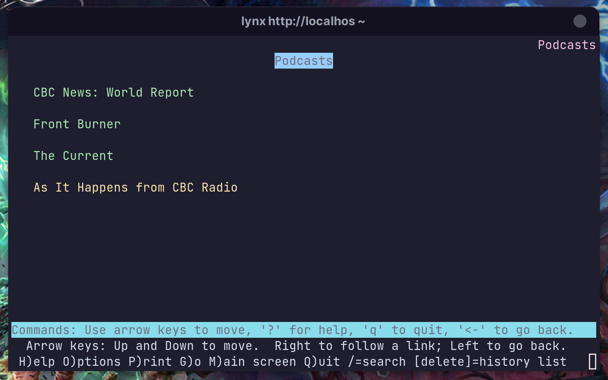
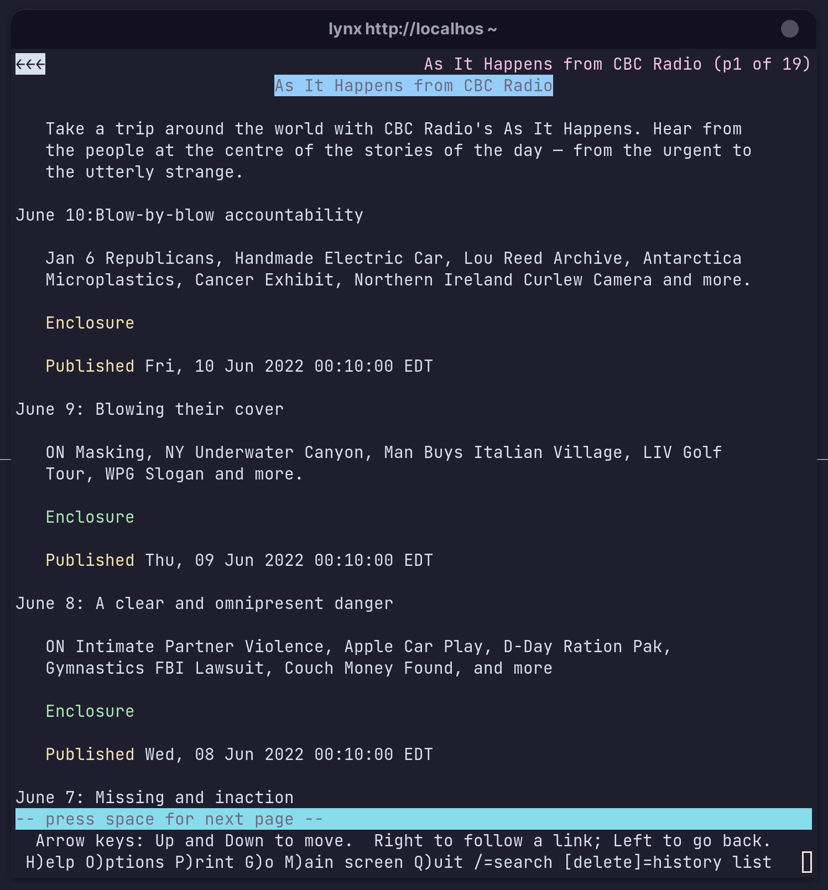

# podfeeds

This is an HTTP server-based podcast aggregator. Just as other aggregators use Chrome to present a GUI, this one uses Lynx
to present a TUI.

Set Lynx up to open media files in your favorite media player. For example, I have the following ~/.mailcap to get Lynx to
open them in mpv:

    audio/*; mpv %s
    video/*; mpv %s
    application/vnd.rn-realmedia; mpv %s

Gather your podcast feed URLs. One way to find them is to
use the "podfeed" script I posted here:

[CLI app to get podcast feed URLs
](https://www.linuxquestions.org/questions/linuxquestions-org-member-success-stories-23/cli-app-to-get-podcast-feed-urls-4175656322/)

Paste them into a file in the root directory (the one with files like go.mod), named "podcasts.yaml". Separate each line with a
hyphen and a space. For example:

    - https://www.cbc.ca/podcasting/includes/wr.xml
    - https://www.cbc.ca/podcasting/includes/frontburner.xml
    - https://www.cbc.ca/podcasting/includes/current.xml
    - https://www.cbc.ca/podcasting/includes/asithappens.xml

Start the server:

    go run .

By default, the server will listen on port 8080. Set the PORT environment variable to override it.

Load the server's index page in Lynx:

    lynx http://localhost:8080

That will get your subscriptions:

Following each link gets you the page for that podcast:

Follow "Enclosure" links to play them.

Or press "d" to download them or whatever; Lynx is very powerful.

## Notes on caching

After writing podcasts.yaml and starting the server for the first time, you need to load "/" once to get
Podfeeds to build the page cache. The cache will then be rebuilt whenever the modification
time of podcasts.yaml changes.

Remember that Lynx requires you to refresh pages manually (by pressing C-r on a page, or following links with "x").

Refreshing a feed page will return Podfeeds' cached version if, and only if, the version on the server has not changed since it was cached.