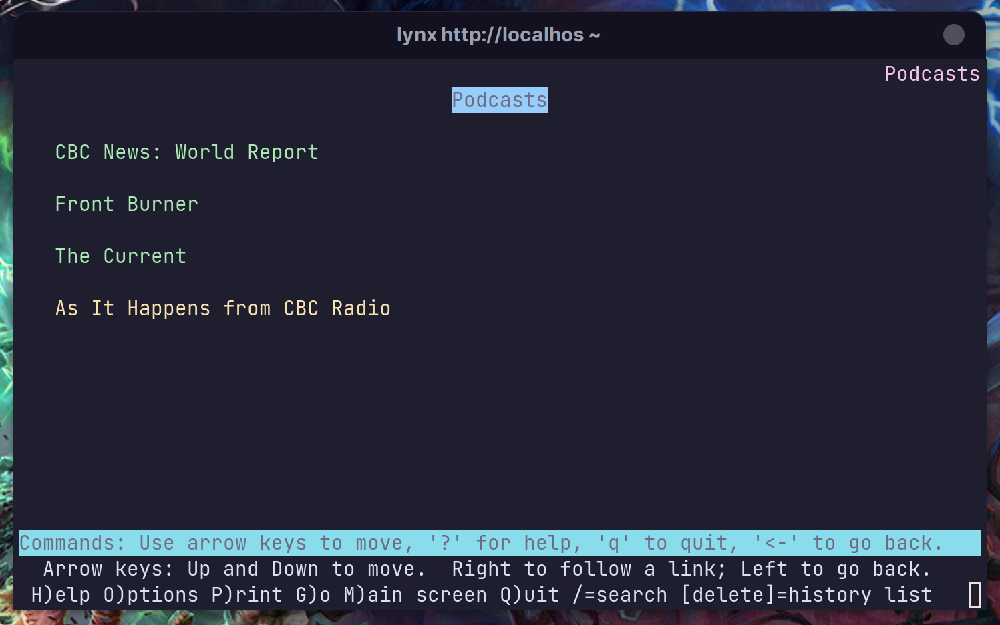
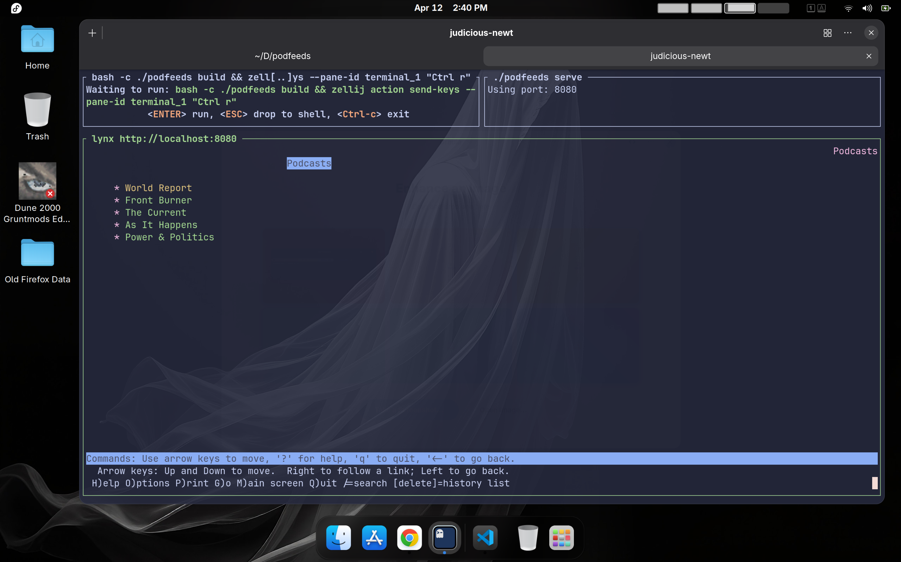

# podfeeds

This is a podcast aggregator. Just as other aggregators use Chrome to present a GUI, this one uses Lynx to present a TUI.

## Setting Up Lynx

Set Lynx up to open media files in your favorite media player. For example, I have the following ~/.mailcap to get Lynx to open them in [mpv](https://mpv.io/):

    audio/*; mpv %s
    video/*; mpv %s
    application/vnd.rn-realmedia; mpv %s

Setting Lynx to always accept cookies will also save a few manual steps. Set the following (make sure they're not commented out) in lynx.cfg:

    FORCE_SSL_COOKIES_SECURE:TRUE
    SET_COOKIES:TRUE
    ACCEPT_ALL_COOKIES:TRUE

There's a fairly obvious section in lynx.lss to make it work with transparent terminals. You'll probably want to set that.

### Downloading Podcasts

Install [HTTPie](https://httpie.io/) and put the following in the EXTERNAL section of lynx.cfg:

    EXTERNAL:https:http -d %s:TRUE

## Building Podfeeds

    go build

That will produce an executable named "podfeeds".

## Gathering Feed URLs

Gather your podcast feed URLs. One way to find them is to
use the "podfeed" script I posted here:

[CLI app to get podcast feed URLs
](https://www.linuxquestions.org/questions/linuxquestions-org-member-success-stories-23/cli-app-to-get-podcast-feed-urls-4175656322/#post6363987)

Paste them into a file named podcasts.yaml, in the repository directory (same directory as the podfeeds executable).

Separate each line with a hyphen and a space, and use # for comments. For example:

    - https://www.cbc.ca/podcasting/includes/wr.xml # CBC World Report
    - https://www.cbc.ca/podcasting/includes/frontburner.xml
    - https://www.cbc.ca/podcasting/includes/current.xml
    # CBC AS It Happens
    - https://www.cbc.ca/podcasting/includes/asithappens.xml
    - https://www.cbc.ca/podcasting/includes/cbcpowerandpolitics.xml

## Building And Serving

Podfeeds is functionally a static site generator. Do the following with the
repository as the current directory:

    ./podfeeds build

That builds the site to _site.

Then, to serve it:

    ./podfeeds serve

By default, the server will listen on port 8080. Set the PORT environment variable to override it. Set it to port 0 to let it pick the port.

Load the server's index page in Lynx:

    lynx http://localhost:8080

## Using Podfeeds

Your podcasts are rendered into an old-fashioned, Lynx-friendly website. There's a landing page at "/" with a link for each subscription. Each of those links goes to a page. That page is an HTML conversion of the podcast's XML file, with a table of contents at the top. Each entry in the table of contents is an episode.

You start on the list of podcasts you're subscribed to.

Following a link gets you the page for that podcast. The page starts with anchor links to specific episodes.

Use the table of contents to jump to episodes. Press Ctrl+A to jump to the beginning of the page, where the table of contents is.

Follow "Enclosure" links to play them.

Or press "." to download them with HTTPie.

## Automating Podfeeds

Behold my [Zellij](https://zellij.dev/) layout!

Refreshing is an UP-key in the top left pane to recall the command line that builds the site, and then sends
the refresh key sequence to the Lynx pane. Lynx is started in ~/Music/podcasts, so episodes I download with "." go directly there.
Exiting Zellij (Ctrl+q) tears everything down.

A separate web server and browser are cool, but this is the user experience I'm actually going for.

Here is the KDL source code for the layout:

    layout {
        pane split_direction="horizontal" {
            pane split_direction="vertical" {
                pane {
                    // https://www.reddit.com/r/zellij/comments/129mftu/in_zellij_it_it_possible_to_start_multiple/
                    // I determined in a previous session that terminal_1 is the id of the Lynx pane.
                    command "bash"
                    args "-c" "./podfeeds build && zellij action send-keys --pane-id terminal_1 \"Ctrl r\""
                    cwd "~/Documents/podfeeds"
                    start_suspended true
                }
                pane {
                    command "./podfeeds"
                    args "serve"
                    cwd "~/Documents/podfeeds"
                }

            }
        }
        pane command="lynx" {
            args "http://localhost:8080"
            cwd "~/Music/podcasts"
            // Not safe to start the browser and the server at the exact same time
            start_suspended true
            focus true
        }
    }

## Appendix: Building Lynx

Lynx needs to be built with --enable-externs, which is needed to enable downloading
with a download manager.

On some systems, you will need to [build Lynx yourself](https://linuxfromscratch.org/blfs/view/stable-systemd/basicnet/lynx.html)
in order to have that. After applying any patches from the previous link, the following configuration will give you a user-level installation with everything you need:

    ./configure --prefix=$HOME/.local --enable-externs --with-zlib --with-bzlib --with-ssl --with-screen=ncursesw --enable-locale-charset --enable-default-colors
    make
    make install

That puts Lynx in ~/.local/bin. Put the source directory in ~/.local/src so that you can "make uninstall" in it. The configuration directory, containing lynx.cfg and lynx.lss, are in ~/.local/etc.

